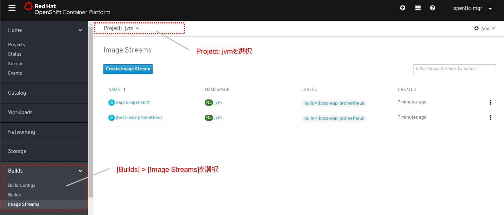

# 1. Prometheus JMX Exporterの展開  

## 1-1. 諸注意

### 1-1-1. JMX Exporterについて

* JMX Exporter は2通りの動作を提供する  
Java Agent (推奨): Java Agent 用 JAR ファイルからメトリクスを収集   
HTTP server: リモートの JMX ターゲットからメトリクスを取得し、HTTP サーバで公開する  
* Java Agent 用 JARファイルの配置方法は次の2通り  
Docker Build Strategy: Dockerfile にビルド済み JAR ファイルを取得し配置する  
S2I: pom.xml に Dependency をセットし、S2I 実行時に Maven でビルドする  

### 1-1-2. 事前準備
事前に講師から以下の対象ホストの接続情報を取得しておく。

* 踏み台サーバー(Bastion Server)のSSHログイン情報  
* 「OpenShift Portal」のアドレス  
例: http://console.openshiftworkshop.com  
* 「Openshift API」のアドレス <OpenShift API>  
例: https://api.cluster.openshiftworkshop.com:6443  
* OpenShiftの(system:admin)ログイン情報

## 1-2. アプリケーション展開

### 1-2-1. OpenShiftログイン  
SSHにて踏み台サーバー(Bastion Server)にログイン。
```
$ ssh <Bastion User>@<Bastion Server>
password: <Bastion Password>
```


OpenShift APIのドメインをもとに、コマンドからOpenShiftにログインを行う。    
ここではノードを確認することで、接続の可否を確認します。  
※OCコマンドは事前にインストールしておく。[OC Command Install](X_GetOCcommand.md)  
```
$ oc login <OpenShift API>
Username: <OpenShift User>
Password: <OpenShift Password>
Login successful.
$ oc get node  
NAME                                              STATUS   ROLES          AGE    VERSION   
ip-10-0-132-236.ap-southeast-1.compute.internal   Ready    infra,worker   98m    v1.13.4+c9e4f28ff  
ip-10-0-137-222.ap-southeast-1.compute.internal   Ready    master         126m   v1.13.4+c9e4f28ff  
ip-10-0-137-90.ap-southeast-1.compute.internal    Ready    worker         117m   v1.13.4+c9e4f28ff  
…
$ oc project
Using project "default" on server "https://<OpenShift API>".
```

### 1-2-2. アプリケーションビルド  
監視対象アプリケーション用の「jmx」という名前のプロジェクトを作る。
```
$ oc new-project jmx
$ oc project
Using project "jmx" on server "https://<OpenShift API>".
```


アプリケーションをリポジトリからCloneして、「jboss-eap-prometheus」イメージをビルド
```
$ git clone https://github.com/openlab-red/jboss-eap-prometheus
$ cd ./jboss-eap-prometheus/
$ oc new-build . -n jmx
--> Found Docker image b72b49b (18 months old) from registry.access.redhat.com for "registry.access.redhat.com/jboss-eap-7/eap70-openshift:latest"
…
--> Success
```

ビルドの状況をocコマンドと、OpenShift Portalから確認
```
$ oc logs -f bc/jboss-eap-prometheus
…
Writing manifest to image destination
Storing signatures
Push successful
※イメージがPushされると動的にログから開放されるので待つ。
(もし「Errorとなってしまった場合は」、[Ctl] + [C]で出て再度やり直す)

$ oc get build -n jmx
NAME                     TYPE     FROM          STATUS     STARTED          DURATION
jboss-eap-prometheus-1   Docker   Git@23160b8   Complete   12 minutes ago   2m47s
$ oc get imagestream -n jmx
NAME                   IMAGE REPOSITORY                                                                                                           TAGS     UPDATED
eap70-openshift        default-route-openshift-image-registry.apps.cluster-tokyo-c2f7.tokyo-c2f7.openshiftworkshop.com/jmx/eap70-openshift        latest   5 minutes ago
jboss-eap-prometheus   default-route-openshift-image-registry.apps.cluster-tokyo-c2f7.tokyo-c2f7.openshiftworkshop.com/jmx/jboss-eap-prometheus   latest   3 minutes ago
```

OpenShift Portalにログインして、[Builds]>[Image Streams]から、ビルドしたイメージがImageStreamに登録されていることも確認



### 1-2-3. アプリケーションデプロイ  

次に、登録した「jboss-eap-prometheus」を利用して、アプリケーションを展開   
展開の際に、Java Agent用JARファイルやJMX Exporter設定ファイルのパスを環境変数(jmx-prometheus.jar=9404)で指定しておく。   
```
$ export JBOSS_HOME=/opt/eap
$ oc new-app -i jboss-eap-prometheus:latest \
  -n jmx \
  --name=jboss-eap-prometheus \
  -e PREPEND_JAVA_OPTS="-javaagent:${JBOSS_HOME}/prometheus/jmx-prometheus.jar=9404:${JBOSS_HOME}/prometheus/config.yaml"
--> Found image 55806df (About a minute old) in image stream "jmx/jboss-eap-prometheus" under tag "latest" for "jboss-eap-prometheus:latest"
…
--> Success
    Application is not exposed. You can expose services to the outside world by executing one or more of the commands below:
     'oc expose svc/jboss-eap-prometheus'
    Run 'oc status' to view your app.
```


展開したアプリケーションを確認。この時点で「jboss-eap-prometheus-1」がRunning状態になれば、デプロイ成功。  
JMX Exporter はデフォルトで9404ポートを公開する。
```
$ oc get svc/jboss-eap-prometheus -n jmx
NAME                   TYPE        CLUSTER-IP       EXTERNAL-IP   PORT(S)                               AGE
jboss-eap-prometheus   ClusterIP   172.30.159.173   <none>        8080/TCP,8443/TCP,8778/TCP,9404/TCP   30s
$ oc get dc/jboss-eap-prometheus
NAME                   REVISION   DESIRED   CURRENT   TRIGGERED BY
jboss-eap-prometheus   1          1         1         config,image(jboss-eap-prometheus:latest)
$ oc get pod -n jmx
NAME                           READY   STATUS      RESTARTS   AGE
jboss-eap-prometheus-1-2z9zs   1/1     Running     0          4m50s
jboss-eap-prometheus-1-deploy  0/1     Completed   0          4m59s
jboss-eap-prometheus-1-build   0/1     Completed   0          9m19s
```

「jboss-eap-prometheus-1-2z9zs」(2z9zsはデプロイしたときにランダムに生成される)がRunning状態になるまで待ちましょう。

### 1-2-4. アプリケーションのアノテーション設定

JMX ExporterのServiceに対して、アノテーションをつけておく。   
```
$ oc annotate svc jboss-eap-prometheus prometheus.io/scrape='true'
service/jboss-eap-prometheus annotated
$ oc annotate svc jboss-eap-prometheus prometheus.io/port='9404'
service/jboss-eap-prometheus annotated
```

### 1-2-5. アプリケーションのルータ設定 

「jboss-eap-prometheus」のアプリケーション(tcp-8080)ポートを、ルータに接続。
```
$ oc expose svc/jboss-eap-prometheus --name=tcp-8080 --port=8080 -n jmx
route.route.openshift.io/tcp-8080 exposed
$ oc get route tcp-8080 -n jmx
NAME       HOST/PORT                                PATH   SERVICES               PORT   TERMINATION   WILDCARD
tcp-8080   tcp-8080-jmx.XXX.openshiftworkshop.com          jboss-eap-prometheus   8080                 None
```

Host/Port(http://tcp-8080-jmx.XXXX.openshiftworkshop.com)をブラウザ上からアクセスすると、アプリケーションコンテンツが確認できる。   
    


次に「jboss-eap-prometheus」のPromtheus Exporter(tcp-9404)ポートを、ルータに接続。
```
$ oc expose svc/jboss-eap-prometheus --name=tcp-9404 --port=9404 -n jmx
route.route.openshift.io/tcp-9404 exposed
$ oc get route tcp-9404 -n jmx
NAME       HOST/PORT                                PATH   SERVICES               PORT   TERMINATION   WILDCARD
tcp-9404   tcp-9404-jmx.XXX.openshiftworkshop.com          jboss-eap-prometheus   9404                 None
```

Host/Port(tcp-9404-jmx.XXXX.openshiftworkshop.com)をブラウザ上からアクセスすると、JMX Exporterから取得したPromSQLのクエリが確認できる。   
    


これで、JMX Exporterの設定は完了。次に[Prometheus Operator](2_PrometheusOperator.md)の作業に進む   

