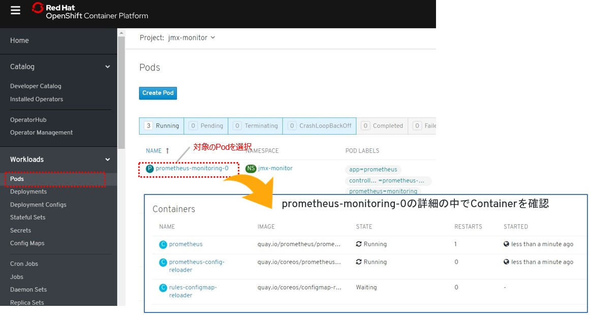
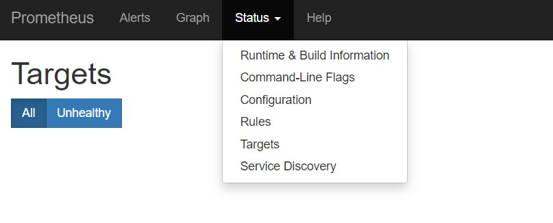
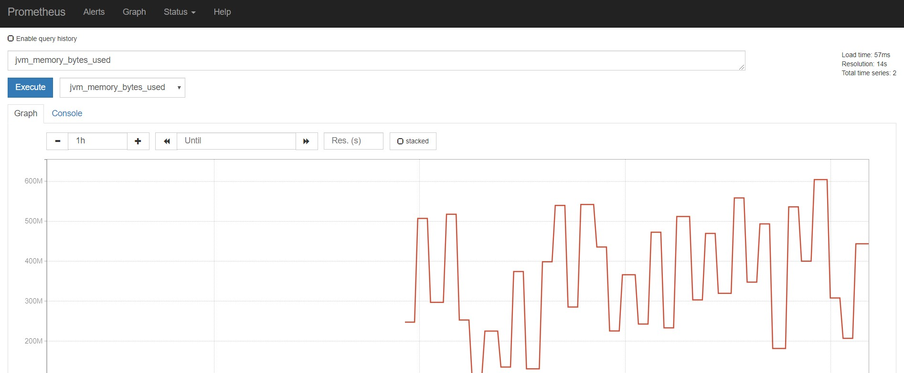

# 3. Custom Resource Definitionの設定 

## 3-1. 諸注意

### 3-1-1. Prometheus OperatorのCRDについて

* v0.12.0から、Prometheus OperatorはKubernetes v1.7.x以上を使用する必要があります。   
* 今回は「Prometheus Operator 0.27.0 provided by Red Hat」を利用しているため、Bug(coreos-prometheus-config-reloaderのMemory Limit)があるため、Work Arroundで回避します。(Prometheus Operator 0.29.0以上で解決)    
* Prometheus OpearatorのCRDはAPIドキュメントを参考にしましょう。   
https://github.com/coreos/prometheus-operator/blob/master/Documentation/api.md   

Serviceの可視化設定をするときは、以下の手順で設定を行います。   
1. Kind「Prometheus」を設定する   
2. PrometheusのGUIを確認する  
3. プロジェクト間通信を許可する   
4. Kind「ServiceMonitor」を設定する    

### 3-1-2. 事前準備

* OpenShiftのOperatorCatalogからPrometheus Opearatorをデプロイしておく。   
* 事前にJMX Exporterを用意しておく。   
JMX Prometheus ExporterのServiceのラベル名(図は「app=jboss-eap-prometheus」)を確認しておきましょう。    
[Networking]>[Services]から確認   


## 3-2. Custom Resource Definitionの設定

### 3-1-1. 「Kind: Prometheus」 を設定する
作成したPrometheus Operatorを利用して、「Kind: Prometheus」を作成します。   
以下のようなPrometheus.specを設定することで、Prometheusの設定が可能です。

| Field | Description | Scheme | Required |
| ----- | ----------- | ------ | -------- |
| replicas | Number of instances to deploy for a Prometheus deployment. | *int32 | false |
| version | Version of Prometheus to be deployed. | string | false |
| serviceAccountName | ServiceAccountName is the name of the ServiceAccount to use to run the Prometheus Pods. | string | false |
| securityContext | SecurityContext holds pod-level security attributes and common container settings. This defaults to the default PodSecurityContext. | *v1.PodSecurityContext | false |
| serviceMonitorSelector | ServiceMonitors to be selected for target discovery. | *[metav1.LabelSelector](https://kubernetes.io/docs/reference/generated/kubernetes-api/v1.11/#labelselector-v1-meta) | false |
| logLevel | Log level for Prometheus to be configured with. | string | false |
| logFormat | Log format for Prometheus to be configured with. | string | false |
| scrapeInterval | Interval between consecutive scrapes. | string | false |
| ruleSelector | A selector to select which PrometheusRules to mount for loading alerting rules from. Until (excluding) Prometheus Operator v0.24.0 Prometheus Operator will migrate any legacy rule ConfigMaps to PrometheusRule custom resources selected by RuleSelector. Make sure it does not match any config maps that you do not want to be migrated. | *[metav1.LabelSelector](https://kubernetes.io/docs/reference/generated/kubernetes-api/v1.11/#labelselector-v1-meta) | false |
| query | QuerySpec defines the query command line flags when starting Prometheus. | *[QuerySpec](https://github.com/coreos/prometheus-operator/blob/master/Documentation/api.md#queryspec) | false |
| alerting | Define details regarding alerting. | *[AlertingSpec](https://github.com/coreos/prometheus-operator/blob/master/Documentation/api.md#alertingspec) | false |
| rules | /--rules.*/ command-line arguments. | [Rules](https://github.com/coreos/prometheus-operator/blob/master/Documentation/api.md#rules) | false |

-------

「jmx-monitor」プロジェクトの[Catalog]>[Intalled Operators]>[Prometheus Operator]を選択し、[Prometheus]タブの「Create Prometheus」から、以下の「Kind: Prometheus」を定義します。    
※この際、Projectが「jmx-monitor」であることを確認。   


#### [Kind: Prometheus]
「serviceMonitorSelector(key: k8s-app)」に記載されているServiceMonitorを監視するように設定します。

```
apiVersion: monitoring.coreos.com/v1
kind: Prometheus
metadata:
  name: monitoring
  labels:
    prometheus: k8s
  namespace: jmx-monitor
spec:
  replicas: 2
  version: v2.7.1
  serviceAccountName: prometheus-k8s
  securityContext: {}
  serviceMonitorSelector:
    matchExpressions:
      - key: k8s-app
        operator: Exists
  ruleSelector:
    matchLabels:
      role: prometheus-rulefiles
      prometheus: k8s
  query:
    timeout: 300s
  alerting:
    alertmanagers:
      - namespace: jmx-monitor
        name: alertmanager-main
        port: web
```
「Kind: Prometheus」を設定すると、Prometheus Operatorが「replicas: 2」の数の分Prometheusに必要なContainerを起動します。    
起動したPromethuesPodを確認しておきましょう。

```
$ oc get pod -n jmx-monitor
NAME                                   READY   STATUS                 RESTARTS   AGE
prometheus-monitoring-0                2/3     CreateContainerError   1          18m
prometheus-monitoring-1                2/3     CreateContainerError   1          18m
prometheus-operator-7767769844-9ln4l   1/1     Running                0          141m
```
ただしこの時点では、Pod内の3コンテナのうち、1つが起動エラー状態です。

### 3-1-2. PrometheusPodのエラーを解消する
「Prometheus Operator 0.27.0」は、Prometheus OperatorのBugにより正しくコンテナが起動しません。(Prometheus Operator 0.29.0以上で解決済)    
したがって、ここではその原因を調査し、ワークアラウンドとしての対応を試みてみましょう。     

```
$ oc get pod -n jmx-monitor
NAME                                   READY   STATUS                 RESTARTS   AGE
prometheus-monitoring-0                2/3     CreateContainerError   1          18m
prometheus-monitoring-1                2/3     CreateContainerError   1          18m
prometheus-operator-7767769844-9ln4l   1/1     Running                0          141m
```
まずはPod内に構築された3つのコンテナのうち、どのコンテナがエラーを起こしているのかを確認します。OpenShift Portalの「JMX Monitor(jmx-monitor)」プロジェクトから[Workloads]>[Pods]>[prometheus-monitoring-0]を選択し、起動失敗しているコンテナの名前を特定してください。    



本来、コンテナが起動していればログが出ますが、起動が失敗しているのでコンテナのログが出ません。
```
$ oc logs prometheus-monitoring-0 -c rules-configmap-reloader -n jmx-monitor
Error from server (BadRequest): container "rules-configmap-reloader" in pod "prometheus-monitoring-0" is waiting to start: CreateContainerError
```

ここではPodのログからエラーの理由を特定します。
```
$ oc get event |grep Failed
21m         Warning   Failed                pod/prometheus-monitoring-0                       Error: set memory limit 10485760 too low; should be at least 12582912
21m         Warning   Failed                pod/prometheus-monitoring-1                       Error: set memory limit 10485760 too low; should be at least 12582912

$ oc describe pod/prometheus-monitoring-0 -n jmx-monitor
  rules-configmap-reloader:
    Container ID:
    …
    State:          Waiting
      Reason:       CreateContainerError
    Ready:          False
    Restart Count:  0
    Limits:
      cpu:     25m
      memory:  10Mi
    Requests:
      cpu:        25m
      memory:     10Mi
    Environment:  <none>
  Events:
   …
  Warning  Failed     21m (x8 over 22m)     kubelet, ip-10-0-157-127.ap-northeast-1.compute.internal  Error: set memory limit 10485760 too low; should be at least 12582912
$ oc get statefulset/prometheus-monitoring
NAME                    READY   AGE
prometheus-monitoring   0/2     125m
```
ここでは「prometheus-config-reloader」のMemory Limitが10Miに設定されているため、コンテナが起動できない状態となっています。 PrometheusPodは、StatefulSetによって起動されているため、今回は一時的にStatefulSetの「prometheus-config-reloader」のResource Limitを引き上げて対応してみましょう。        

#### VIEDITORで更新

```
$ oc get statefulset/prometheus-monitoring -n jmx-monitor -o=jsonpath='{.spec.template.spec.containers[2].args.resources.limits}' 
map[cpu:25m memory:10Mi]
$ oc edit statefulset/prometheus-monitoring -n jmx-monitor

### rules-configmap-reloaderのMemory Limitを10Miから30Miに引き上げる
```

最終的にPrometheusPodが正常に稼働していることを確認する。   

```
$ oc get pod -n jmx-monitor
NAME                                   READY   STATUS    RESTARTS   AGE
prometheus-monitoring-0                3/3     Running   1          34m
prometheus-monitoring-1                3/3     Running   1          35m
prometheus-operator-7767769844-bvlfs   1/1     Running   0          47m
$ oc get statefulset/prometheus-monitoring
NAME                    READY   AGE
prometheus-monitoring   2/2     137m
```
Pod内の3つのコンテナが起動すれば、ワークアラウンドとしては解決です。    
今回はあくまでワークアラウンドにて対応しましたが、「Prometheus Operator 0.29.0」以上では、prometheus-config-reloaderのデフォルトのMemory Limitが修正され、解決されています。   
(参照):  https://github.com/coreos/prometheus-operator/pull/2403/

### 3-1-3. PrometheusのGUIを確認する
PrometheusのGUIを表示します。OperatorのServiceに対してRouterを接続します。
```
$ oc get svc -n jmx-monitor
NAME                  TYPE        CLUSTER-IP   EXTERNAL-IP   PORT(S)    AGE
prometheus-operated   ClusterIP   None         <none>        9090/TCP   5m39s
$ oc expose service prometheus-operated -n jmx-monitor
route.route.openshift.io/prometheus-operated exposed
$ oc get route -n jmx-monitor
NAME                  HOST/PORT                                                   PATH   SERVICES              PORT   TERMINATION   WILDCARD
prometheus-operated   prometheus-operated-jmx-monitor.apps.ocp4ws-00.k8show.net          prometheus-operated   web                  None
```

Routerが接続できたら、ブラウザより確認を行ってください。(例では、http://prometheus-operated-jmx-monitor.apps.ocp4ws-00.k8show.net)   
なお、この時点では何も監視登録設定されていないため、PrometheusのGUIに接続できるものの[Status]>[Targets]には何も監視対象が表示されません。   



### 3-1-4. プロジェクト間通信を許可する
Prometheus Operatorを配置した「JMX Monitor(jmx-monitor)」プロジェクトとアプリを配置した「JMX Exporter(jmx)」プロジェクト間のネットワークポリシーを設定します。    

* 参照   
https://docs.openshift.com/container-platform/3.11/architecture/additional_concepts/authorization.html

ここでは事前に、「JMX Monitor(jmx-monitor)」のPrometheus Operatorに設定したサービスアカウント(prometheus-k8s)に対して、「JMX Exporter(jmx)」プロジェクトに参照権限を付与しています。また、「JMX Exporter(jmx)」プロジェクトに対するPodネットワーク許可を追加しています。

```
$ oc adm policy add-role-to-user view system:serviceaccount:jmx-monitor:prometheus-k8s -n jmx
clusterrole.rbac.authorization.k8s.io/view added: "system:serviceaccount:jmx-monitor:prometheus-k8s"
$ oc adm pod-network join-projects --to=jmx jmx-monitor
using plugin: "redhat/openshift-ovs-networkpolicy", managing pod network is only supported for openshift multitenant network plugin
```

### 3-1-5. 「Kind: ServiceMonitor」を設定する
最後にServiceMonitorを設定してJMXの値をPrometheusから取得し、可視化します。    
以下のような、値を設定することによって、監視対象を特定できます。    

| Field | Description | Scheme | Required |
| ----- | ----------- | ------ | -------- |
| jobLabel | The label to use to retrieve the job name from. | string | false |
| targetLabels | TargetLabels transfers labels on the Kubernetes Service onto the target. | []string | false |
| podTargetLabels | PodTargetLabels transfers labels on the Kubernetes Pod onto the target. | []string | false |
| endpoints | A list of endpoints allowed as part of this ServiceMonitor. | [][Endpoint](https://github.com/coreos/prometheus-operator/blob/master/Documentation/api.md#endpoint) | true |
| selector | Selector to select Endpoints objects. | [metav1.LabelSelector](https://kubernetes.io/docs/reference/generated/kubernetes-api/v1.11/#labelselector-v1-meta) | true |
| namespaceSelector | Selector to select which namespaces the Endpoints objects are discovered from. | [NamespaceSelector](https://github.com/coreos/prometheus-operator/blob/master/Documentation/api.md#namespaceselector) | false |
| sampleLimit | SampleLimit defines per-scrape limit on number of scraped samples that will be accepted. | uint64 | false |

「jmx-monitor」プロジェクトの[Catalog]>[Intalled Operators]>[Prometheus Operator]を選択し、[ServiceMonitor]タブの「Create ServiceMonitor」から、以下の「Kind: ServiceMonitor」を定義します。
※この際、Projectが「jmx-monitor」であることを確認。


#### [Kind: ServiceMonitor]
```
apiVersion: monitoring.coreos.com/v1
kind: ServiceMonitor
metadata:
  name: jmx-monitor
  labels:
    k8s-app: prometheus
  namespace: jmx-monitor
spec:
  endpoints:
    - interval: 60s
      port: 9404-tcp
      scrapeTimeout: 55s
  namespaceSelector:
    matchNames:
      - jmx
  selector:
    matchLabels:
      app: jboss-eap-prometheus
```

「Kind: ServiceMonitor」を設定すると、Prometheus Operatorが同一ラベルのPrometheus(k8s-app: prometheus)に対して、ExporterのService(app: jboss-eap-prometheus)から監視対象を特定します。    
PrometheusのGUI(例では、http://prometheus-operated-jmx-monitor.apps.ocp4ws-00.k8show.net) の[Status]>[Targets]から、対象が表示されることを確認してみましょう。ただし、Prometheusの設定が読み込まれ、出力表示が切り替わるまでに少し時間がかかります。    


Targetが正しく表示でき、StateがUP状態であれば、JMXの値も確認できます。[Graph]>[-insert metric at cursor-]から、「jvm_memory_bytes_used」などを確認してみましょう。   
[Graph]のタブを押すと、可視化された値が表示できます。



以上でPrometheus Operatorの基本利用は完了です。     
同じ要領で、AlertManagerも設定してみましょう。     
参考：　https://sysdig.com/blog/kubernetes-monitoring-prometheus-operator-part3/
