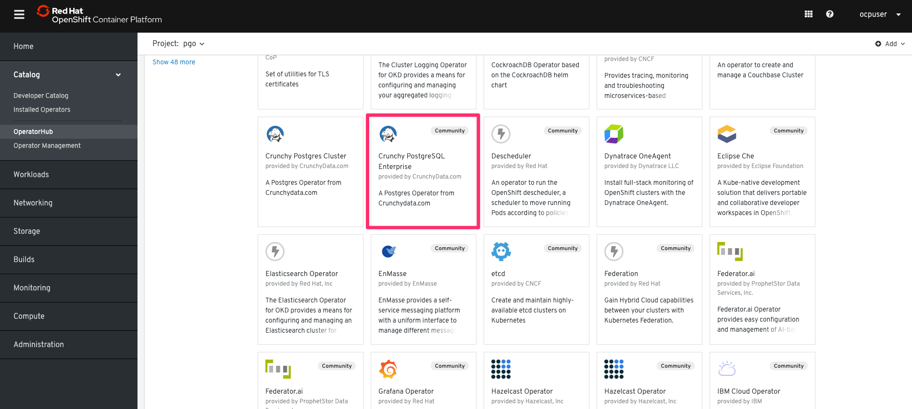
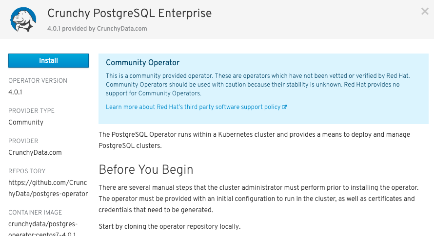
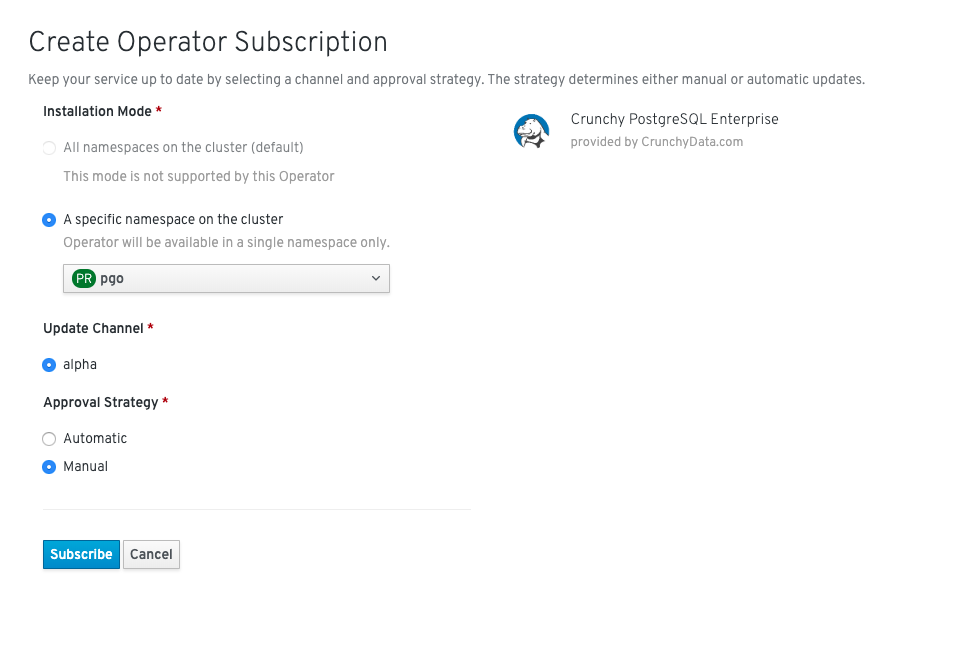
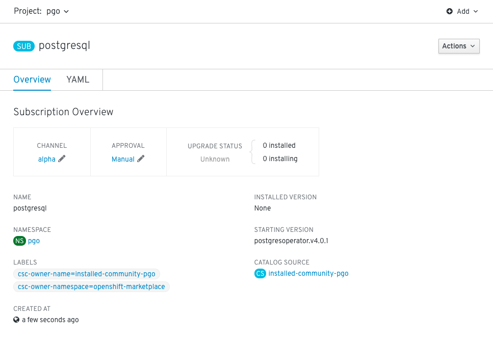
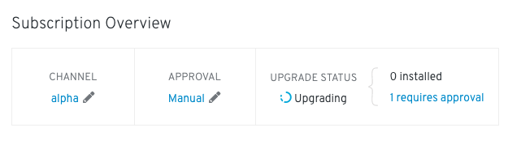
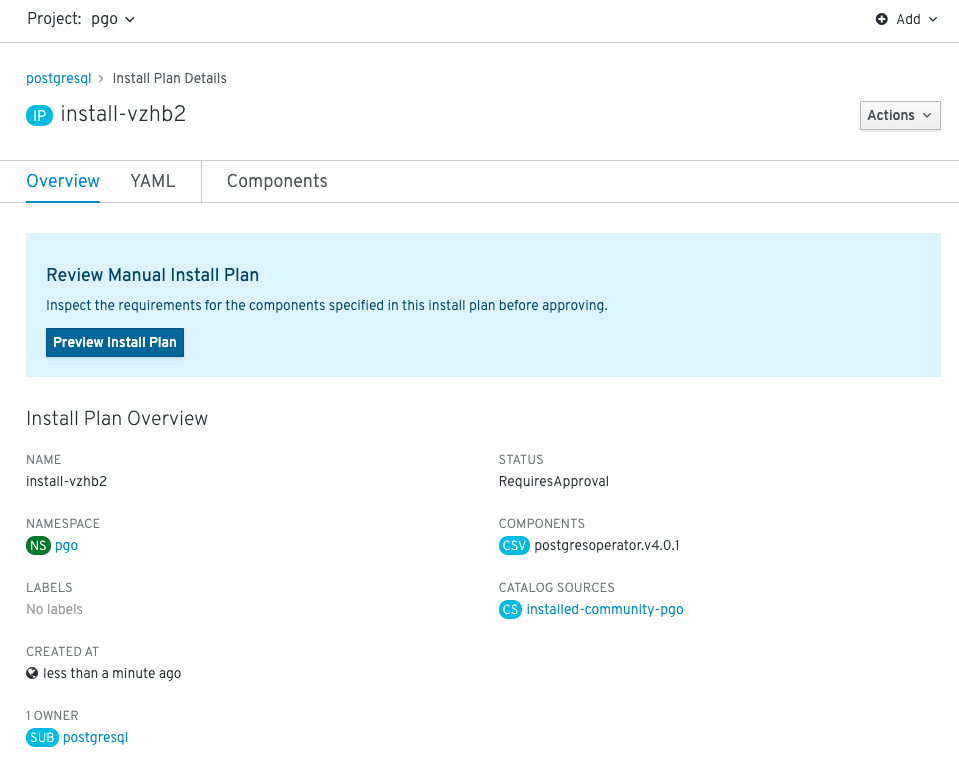
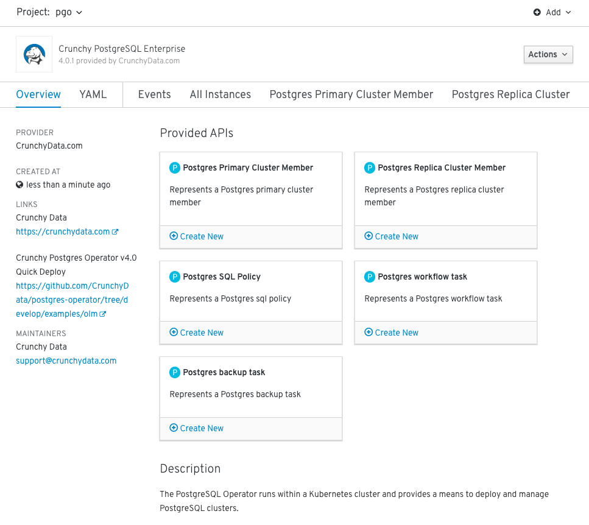
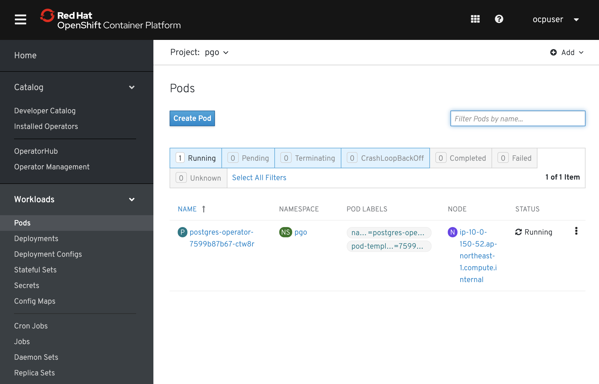
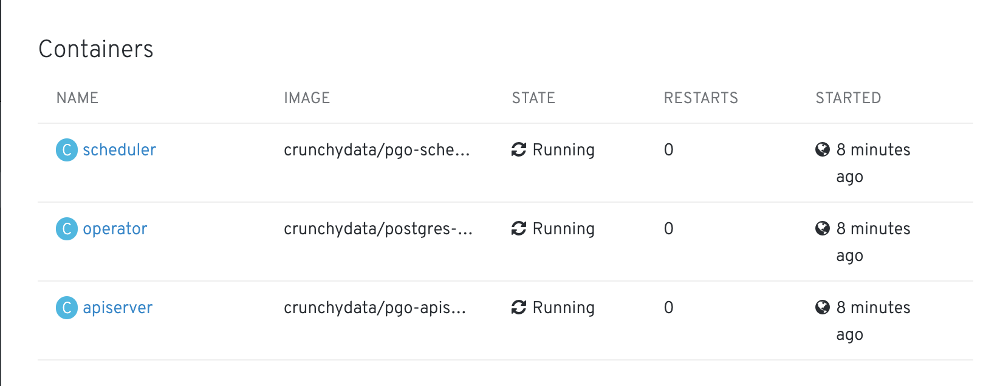

# 1. Crunchy PostgreSQL Operatorのインストール  

## 1-1. 諸注意

### 1-1-1. Crunchy PostgreSQL Operatorについて

*   Crunchy PostgreSQL Operatorは，Kubernetes上におけるPostgreSQLの運用を担う Custom ControllerとCustom Resourceから成る    
    * PostgreSQLクラスター構築/削除
    * Posgresインスタンスのスケールアウト/スケールイン
    * Posgresインスタンスバックアップ/リストア
    * etc.
    * (以降，Postgres Operatorと呼ぶ)

### 1-1-2. 事前準備
事前に講師から以下の対象ホストの接続情報を取得しておく。

* 踏み台サーバー(Bastion Server)のSSHログイン情報  
    * 例) `<Bastion_User>`: **ec2-user**
    * 例) `<Bastion_Server_IP>`: **18.31.178.231**
    * 例) `<Private_Key>`: **key.pem**
    * SSHログイン例):
      * `$ ssh -i key.pem ec2-user@18.31.178.231`
* 「OpenShift」のログイン情報 
    * `<OpenShift_Username>`: **ocpuser**
    * `<OpenShift_Password>`: **ocppass**
* 「OpenShift Portal」のアドレス  
    * 例) `<OpenShift_Console>`: http://console.openshiftworkshop.com
    * OCP Portalログイン例):
      * `ブラウザで https://console-openshift-console.apps.ocp4ws-00.k8show.net にアクセス`
      * `ocpuser` / `ocppass` を入力してログイン
* 「Openshift API」のアドレス  
    * 例) `<OpenShift_API>`: **https://api.ocp4ws-00.k8show.net:6443** 
    * ocコマンドのログイン例):
      * `$ oc login https://api.ocp4ws-00.k8show.net:6443`
      * `ocpuser` / `ocppass` を入力してログイン

## 1-2. Postgres Operatorの展開

### 1-2-1. 踏み台サーバー(Bastion Server) にログイン
SSHにて踏み台サーバー(Bastion Server)にログイン。  
```
ssh -i <Private_Key> <Bastion_User>@<Bastion Server IP>

y
```

### 1-2-2. Postgres Operatorプロジェクトを取得
GitHubからクローン。  
```
git clone https://github.com/capsmalt/postgres-operator.git
cd postgres-operator
```

### 1-2-3. Operator構成の編集
Imageタグと，StorageClassタイプを変更。
```
vi conf/postgres-operator/pgo.yaml 
...
CCPImageTag:  centos7-11.3-2.4.1
...
...
storageos:
  AccessMode:  ReadWriteOnce
  Size:  1G
  StorageType:  dynamic
  StorageClass:  gp2
  Fsgroup:  26
...
```

### 1-2-4. Operator API用の証明書を作成
Operator API用の自己署名証明書を作成。
```
export PGOROOT=$HOME/postgres-operator
cd $PGOROOT/deploy
$PGOROOT/deploy/gen-api-keys.sh
$PGOROOT/deploy/gen-sshd-keys.sh
cd $PGOROOT
```

### 1-2-5. OpenShiftにログイン
OpenShiftにコマンドからログイン。  
```
oc login <OpenShift_API>

Username: "ocpuser" を入力
Password: "ocppass" を入力
```

### 1-2-6. Operatorインストールに必要なKubernetesリソースを作成
**"pgo"** Namespaceを作成。
```
oc create namespace pgo 
oc project pgo
```

**"pgo-backrest-repo-config"** Secret を作成
```
kubectl create secret generic -n pgo pgo-backrest-repo-config \
  --from-file=config=$PGOROOT/conf/pgo-backrest-repo/config \
    --from-file=sshd_config=$PGOROOT/conf/pgo-backrest-repo/sshd_config \
  --from-file=aws-s3-credentials.yaml=$PGOROOT/conf/pgo-backrest-repo/aws-s3-credentials.yaml \
  --from-file=aws-s3-ca.crt=$PGOROOT/conf/pgo-backrest-repo/aws-s3-ca.crt
```

**"pgo-auth-secret"** Secret を作成
```
kubectl create secret generic -n pgo pgo-auth-secret \
  --from-file=server.crt=$PGOROOT/conf/postgres-operator/server.crt \
  --from-file=server.key=$PGOROOT/conf/postgres-operator/server.key \
  --from-file=pgouser=$PGOROOT/conf/postgres-operator/pgouser \
  --from-file=pgorole=$PGOROOT/conf/postgres-operator/pgorole
```

既存のクレデンシャルを削除 (存在しない場合は not found になりますが正常です)
```
kubectl delete secret -n pgo tls pgo.tls
```

pgi-apiserverへのクレデンシャルを作成
```
kubectl create secret -n pgo tls pgo.tls \
  --key=$PGOROOT/conf/postgres-operator/server.key \
  --cert=$PGOROOT/conf/postgres-operator/server.crt
```

**"pgo-config"** ConfigMap を作成
```
kubectl create configmap -n pgo pgo-config \
--from-file=$PGOROOT/conf/postgres-operator
```

### 1-2-7. Operatorをインストール
OpenShift Portalにログイン。
* 「OpenShift Portal」のアドレス  
    * 例) `<OpenShift_Console>`: http://console.openshiftworkshop.com
    * OCP Portalログイン例):
      * `ブラウザで https://console-openshift-console.apps.ocp4ws-00.k8show.net にアクセス`
      * `ocpuser` / `ocppass` を入力してログイン


[Catalog]>[OperatorHub]から，[Crunchy PostgreSQL Enterprise (Community)]を開く。  


[Continue]>[Install]と進める。  


Approval Strategy "Manual"を選択し，他はデフォルト値で [Subscribe]する。  
※注意: Namespaceが**pgo**であることを確認


以下図に遷移したら少し待つ。  


"1 requres approval" の表記を確認したら選択する。  


"Preview Install Plan" を選択する。  


"Approve" を選択する。  


[Catalog]>[Installed Operators]>[Crunchy PostgreSQL Enterprise]と辿り，CRDs(5つ)によってKubernetesが拡張されたことを確認する。  



### 1-2-8. Postgres CRDを確認
踏み台サーバー(Bastion Server)で，Postgres CRDを確認。
```
oc get crd | grep pg

pgbackups.crunchydata.com                                   2019-08-05T04:56:10Z
pgclusters.crunchydata.com                                  2019-08-05T04:56:10Z
pgpolicies.crunchydata.com                                  2019-08-05T04:56:10Z
pgreplicas.crunchydata.com                                  2019-08-05T04:56:10Z
pgtasks.crunchydata.com                                     2019-08-05T04:56:10Z
```

### 1-2-9. Operator Podを確認
Postgres OperatorのDeploymentは1つのPodを管理しています。Podには3つのコンテナが含まれます。

* operator
* scheduler
* apiserver

ocコマンドで確認。
```
oc get deploy -n pgo

NAME                             READY   UP-TO-DATE   AVAILABLE   AGE
postgres-operator                1/1     1            1           9h
```

```
oc get po -n pgo

postgres-operator-9777dbc48-59kms                 3/3     Running     0          9h
```

```
oc get po -n pgo -o yaml
```

[OCP_Portal]>[Workloads]>[Pods]>[postgres-operator-xxxx-xxx]>[Container]欄にて3つのコンテナが動作していることを確認できる。

  

  

---
これで，Crunchy PostgreSQL Operatorの展開は完了です。  
次に [pgoの構成とPostgreSQLリソース制御](2_usage-pgo.md) のハンズオンに進みます。
