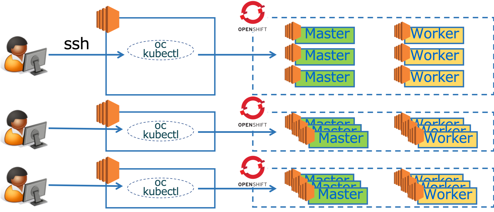

# ハンズオン概要
本ハンズオンは，OpenShift4(以降，OCPまたはOCP4)のインフラ向け応用編です。  
基礎編(OCP基礎)および開発向け応用編(CodeReady他)のワークショップも不定期開催しています。

OCP4インフラ向け応用編では以下を学びます。

- Operatorの導入
- Operatorとアプリケーションの連携
- Custom Resourceの設定
- Operatorに対するCLI操作

### Lab1: [アプリケーション と Operator 連携](Lab1)

### Lab2: [Operator導入 と CLI活用](Lab2)

# ハンズオン環境
本ハンズオンは，Kubernetesクラスター(OpenShift)の動作環境としてAWSを使用します。今回は構築済です。  

OCPクラスターに対するCLI操作をを行う際は，クライアントPCから，踏み台サーバー(Bastion Server)にSSH接続し，**ocコマンド** を使って制御します。  
`クライントPC <--SSH--> 踏み台サーバー <--oc--> OpenShift クラスター`

GUI操作は，クライアントPCのブラウザ(**Chrome/Firefox推奨**)を使用します。  

# 前提
以下の準備および確認を事前に済ませておいてください。
- SSH用ツール (EC2への接続する際に使用します)
- ブラウザ (Google Chrome or Firefox)
- ブラウザでの接続テスト
  - 下記リンクにブラウザからアクセスし，メモ帳アプリに正常アクセスできるか確認してください。
  - xxxxxx
  - **接続できない環境の場合はハンズオンを実施できない場合があります (サポートが必要な場合は担当者まで連絡ください)**

# 注意事項
OCPクラスター接続情報など当日の連絡事項 (Etherpad) ==> 当日ご案内します

# タイムテーブル

|Time|Agenda|Content|
|:---:|:---|:---|
|13:00-13:30|受付||
|(30min)|<講義> OCP4 概要 & Operator 概要|OCP基礎   Controller/Resource基礎   Operator基礎|
|(20min)|ハンズオン環境への接続確認||
|(10min)|<講義> Prometheus Operator||
|(60min)|<ハンズオン> アプリ と Operator 連携|Prometheus Operator|
|(15min)|Break||
|(45min)|<ハンズオン> Operatorの導入 と CLI活用|PostgreSQL Operator|
|-17:00|アンケート記入，QA, フリーディスカッションタイム||
